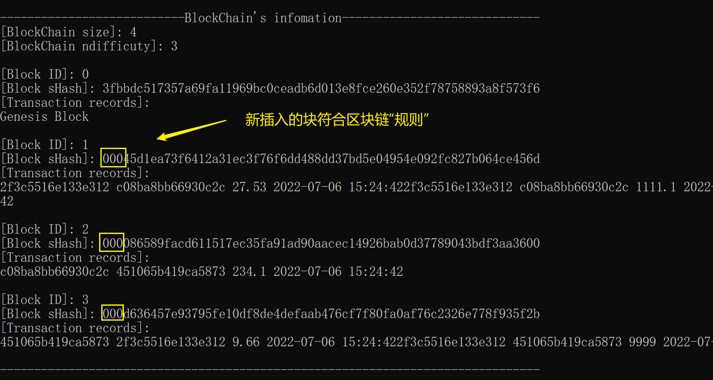

## 区块链(Item_BlockChain)
**@author: lancer						@time: 2022/7/6**

---
[TOC]


+ 区块链：是一个又一个区块组成的链条。每一个区块中保存了一定的信息，它们按照各自产生的时间顺序连接成链条。这个链条被保存在所有的服务器中，只要整个系统中有一台服务器可以工作，整条区块链就是安全的。相比于传统的网络，区块链具有两大核心特点：一是数据难以篡改、二是去中心化。基于这两个特点，区块链所记录的信息更加真实可靠，可以帮助解决人们互不信任的问题。
+ 本项目（项目仅供学习参考使用）使用c++编写代码模拟了区块链的运作过程，所使用的外部库有``SHA256``、``Openssl``、``Boost``。
+ 项目链接：https://github.com/lancerstadium/Item_BlockChain
+ 介绍视频：https://www.bilibili.com/video/BV1ST411u7Jz/?vd_source=a46aee5caa4e010c950debd43a109188

---
### 0 参考目录
+ 区块链架构：https://github.com/teaandcode/TestChain 
+ SHA256散列技术：http://www.zedwood.com/article/cpp-sha256-function
+ openssl库官网：https://www.openssl.org/source/
+ openssl下载器：http://slproweb.com/products/Win32OpenSSL.html
+ boost库官网：https://www.boost.org/users/download/

---
### 1 项目目录
``` 
Item_BlockChain
    |----attachment		// 存储.md链接的图片
    |----env
    |     |----boost_1_79_0.zip      // boost库安装包
    |     |----Win32OpenSSL-1_1_1p.msi   // openssl下载器
    |
    |----source
    |     |----Block.cpp    // Block类实现函数
    |     |----Block.h      // Block类头文件
    |     | ...
    |     |----main.app     // 主函数
    |     | ...
    |
    |----README.md    	// 本文档：项目说明文档
    
```

---
### 2 环境准备
#### 2.1 下载安装Visual Studio (2019)
+ 下载（略）
+ 新建C++空项目；
+ 将Item_BlockChain/source/下的文件全部复制到项目文件夹；
+ 在VS->右键头文件->添加->现有项，导入除main.cpp以外的所有文件；
+ 同理，右键源文件导入main.cpp.
#### 2.2 安装Openssl库
+ 文件已经下载好，点击Item_BlockChain/env/Win32OpenSSL-1_1_1p.msi安装即可，完成后有如下文件结构：

+ 复制头文件路径1：[自己的路径]\openssl_win32\include
+ 复制依赖路径2：[自己的路径]\OpenSSL-Win32\lib\VC
+ 在VS->右键项目名->属性->VC++目录->常规，[包含目录]后面粘贴路径1，[库目录]后面粘贴路径2；
+ 在VS->右键项目名->属性->链接器->输入->附加依赖项后面加上如下字串：libcrypto32MD.lib;libcrypto32MDd.lib;libcrypto32MT.lib;libcrypto32MTd.lib;libssl32MD.lib;libssl32MDd.lib;libssl32MT.lib;libssl32MTd.lib;
+ 确认修改，完成安装；
+ 如有需要重新下载（一般不需要），请用openssl下载器下载Win32 Openssl v1.1.1p如图：

+ 后续请查看教程：https://www.cnblogs.com/zwh0910/p/15885865.html
#### 2.3 安装Boost库
+ 去官网下载：boost_1_79_0.zip
+ boost库安装教程：https://blog.csdn.net/weixin_39766005/article/details/120305393
+ 注：如果编译期间有什么问题可查看本文最后一小节，如果没能帮助到你，我很抱歉，请原谅我不整洁的代码。

### 3 功能简介
+ 想详细了解类之间的关系，可查看第5节
#### 3.1 用户类User
+ ``User``是使用区块链记账系统的用户类，其有如下功能：
``` c++
class User {
public:
	string UserName;	  // 用户名
	string sRSAPriKey;	// 私钥
	string sRSAPubKey;	// 公钥
	double USD;			    // 账户余额
	string Wallet;		  // 钱包

	User();     // 用户构造函数
	User(const string& name);
	
	~User();    // 析构函数

	void info();      // 查询用户信息
	Record PayTo(User seller, double cost);   // 用户付款给卖家

private:
	string _pub_key_path;   // 公钥文件路径
	void _GenerateRSAkey();   // 生成密钥对

};

```

#### 3.2 记录类Record
+ ``Record``表示每次发生交易生成的记录，其有如下功能：
``` c++
class Record {
public:
	string clear_text;          // 明文
	vector<char> cripher_text;  // 暗文
	string pub_key;             // 买家公钥
	int status;                 // 状态: -1表示信息不完成且未录入，0表示信息完整且待录入，1表示录入成功
	string ReturnTime();        // 返回时间
	string PubKey_Path;         // 公钥文件路径

	Record();     // 空参构造函数
	Record(const string& sell, const string& buy, double cost);   // 交易记录构造函数
	~Record();    // 微不足道的析构函数
	void recovery();    // 从明文中恢复交易记录

	void print();       // 打印交易记录
	string toString();  // 生成交易字符串

private:
	string _Seller; // 卖家
	string _Buyer;  // 买家
	double _Value;  // 交易价格
	time_t _Time;   // 交易时间

};

```

#### 3.3 记录序列类RecordList
+ ``RecordList``为录入的交易记录的集合，其有如下功能：
``` c++
class RecordList {
public:
	RecordList();   // 交易记录列表生成

	int size();     // 查询交易记录列表大小
	void print();   // 打印交易记录列表信息
	string toString();    // 转换交易列表信息为String

	void AppendRecord(Record rNew);   // 插入新记录
	void AppendRecordFromFile(string RecordFileName);     // 从文件读入记录信息

private:	
	vector<Record> _vRL;  // 交易记录列表数据

};
```

#### 3.4 区块类Block
+ ``Block``表示区块，与RecordList类一一对应，其有如下功能：
``` c++
class Block {
public:
    // 规定一个区块的hash必须以ndifficulty个0开头
    string sHash;       // 当前区块的哈希值字符串
    string sPrevHash;   // 链接上一区块的哈希值字符串
    
    Block(uint32_t nIndexIn, const string& info); // 消息生成区块
    Block(uint32_t nIndexIn, RecordList& RL);     // 导入RecordList生成区块
    
    void MineBlock(uint32_t nDifficulty);   // 挖矿
    void print(); // 打印区块
    string toString();

private:   
    uint32_t _nIndex; // 区块编号：该区块唯一编号
    uint32_t _nNonce; // 工作量证明：表明获取这个区块总共计算了多少次
    string _sData;    // 区块交易数据，采用RecordList.toString()的数据
    time_t _tTime;    // 区块生成时间

    string _CalculateHash() const;  // 计算哈希值
};

```

#### 3.5 区块链类Blockchain
+ ``Blockchain``表示区块链，其有如下功能：
``` c++
class Blockchain {
public:
    Blockchain(); // 区块链构造函数
    Blockchain(uint32_t nDifficulty);   // 注意：难度不要设置太高不然你显卡就炸了

    void AppendBlock(Block bNew);     // 添加区块
    
    int size();   // 查询区块链大小
    void print(); // 打印区块链
    string toString();

private:
    vector<Block> _vChain;// 区块链数据
    uint32_t _nDifficulty;// 难度级别：建议设为3~4

    Block _GetLastBlock() const;// 取最后区块
};

```

#### 3.6 部分其它类
+ rsa2048：有基于 ``openssl``与``boost``库编写的工具类``RSATool``，它有如下功能：
  + 通过RSA-2048算法生成密钥对，并存入文件``prikey.pem``, ``pubkey.pem``
  + 生成用户钱包名称``Wallet``
  + 通过(私钥文件/字符串)加密明文``clear_text``
  + 通过(公钥文件/字符串)解密暗文``cripher_text``
  + 比对明文与暗文，并输出验证结果
  + 序列化``Record``类到文件``./public/record.txt``，可进行读写操作
+ sha256：提供了SHA-256算法。
+ 注：
  + RSA-2048：为非对称成加密算法，发送方和接收方均各有一组公钥和私钥key。因存在幂运算，其计算速度远远小于AES-256。可用于对小量数据的加密，如用于对密钥key的加密。是密钥交换协议的重要组成部分。采用公钥进行加密，采用私钥进行解密。
  + SHA-256：不是加解密算法，是一个安全Hash算法。可用于确认数据的完整性。可称为one way encryption，不存在相应的解密算法。

---
### 4 代码演示
+ 4.1 生成用户，并输出用户信息：
``` c++
    // 生成新用户
    User user1 = User("马云");
    User user2 = User("刘强东");

    // 查询用户信息
    user1.info();
    user2.info();
```

+ [控制台输出]：

+ [文件输出]：

+ [说明]：
  + 控制台输出用户信息，发现已生成密钥对和钱包；
  + 检查用户同名文件夹，发现多出私钥``prikey.pem``和公钥``pubkey.pem``两个文件，文件内容与输出信息相同。
  + 这一行为模拟了用户注册登录时随机生成密钥对和钱包，并存入本地的私人文件夹。

+ 4.2 进行交易，并输出交易记录：
``` c++
user1.PayTo(user2, 27.53);
```
+ [控制台输出]：

+ [文件输出]：

+ [说明]：
  + 控制台输出交易信息，是两者之前的钱包进行交易，保证了信息的保密性；
  + 检查``./public``文件夹，发现多出临时记录文件``record.txt``，可供各节点提取交易信息；
  + 在实践中``./public``文件夹需要部署到服务器上公共访问，这样就模拟了用户交易广播的状态。

+ 4.3 生成记录表``RecordList``，并插入记录：
``` c++
    // 生成记录表
    RecordList RL = RecordList();
    // 记录表添加记录
    RL.AppendRecord(user1.PayTo(user2, 27.53));
```
+ [控制台输出]：

+ [说明]：
  + 记录表添加记录时会用购买者公钥解密、比对明文密文，如果一致（即信息未经过篡改，并且有本人签名），则会将就记录状态改为1，表示其为经检验的记录；
  + 但是各个节点添加记录时，只能反序列化Record文件，于是便有下面函数:
``` c++
    // 生成记录表
    RecordList RL = RecordList();
    // 记录表添加记录
    RL.AppendRecordFromFile("./public/record.txt");
```
+ [控制台输出]：

+ [说明]：
  + 上述模拟了各个节点获取公共区域的记录文件并读入到自己的``RecordList``的行为。
  + 同理，我们可生成多条记录并打印``RecordList``信息：
``` c++
    // 生成记录表
    RecordList RL = RecordList();
    // 记录表添加记录
    user1.PayTo(user2, 27.53);
    RL.AppendRecordFromFile("./public/record.txt"); // 读取
    user1.PayTo(user2, 1111.1);
    RL.AppendRecordFromFile("./public/record.txt"); // 读取
    user2.PayTo(user1, 618.99);
    RL.AppendRecordFromFile("./public/record.txt"); // 读取
    RL.print();
```
+ [控制台输出]：


+ 4.4 生成区块``Block``，并插入上述记录表``RecordList``：
``` c++
    // 生成区块
    Block b1 = Block(1, RL);
    b1.print();
```
+ [控制台输出]：

+ [说明]：
  + 上述模拟了各个节点将``RecordList``一对一链接到``Block``的行为；
  + 此时该区块的哈希值并不满足区块链的“规范”（规定一个区块的hash必须以ndifficulty个0开头），各个节点并没有权力写入区块链。

+ 4.5 挖矿``AppendBlock``并写入区块链``Blockchain``：
``` c++
    // 生成新用户
    User user1 = User("马云");
    User user2 = User("刘强东");
    User user3 = User("马化腾");

    // 生成记录表
    RecordList RL = RecordList();
    RecordList RL2 = RecordList();
    RecordList RL3 = RecordList();
    // 记录表添加记录
    user1.PayTo(user2, 27.53);
    RL.AppendRecordFromFile("./public/record.txt"); // 读取
    user1.PayTo(user2, 1111.1);
    RL.AppendRecordFromFile("./public/record.txt"); // 读取
    user2.PayTo(user1, 618.99);
    RL.AppendRecordFromFile("./public/record.txt"); // 读取
    user2.PayTo(user3, 234.1);
    RL2.AppendRecordFromFile("./public/record.txt"); // 读取
    user3.PayTo(user1, 9.66);
    RL3.AppendRecordFromFile("./public/record.txt"); // 读取
    user1.PayTo(user3, 9999);
    RL3.AppendRecordFromFile("./public/record.txt"); // 读取

    
    // 系统自动生成难度为3的区块链
    Blockchain BC(3);

    // 生成区块
    Block b1 = Block(1, RL);
    Block b2 = Block(2, RL2);
    Block b3 = Block(3, RL3);

    // 挖矿，尝试连入区块链
    BC.AppendBlock(b1);
    BC.AppendBlock(b2);
    BC.AppendBlock(b3);
    // 查看区块链信息
    BC.print();
```
+ [控制台输出]：

+ 最后查看马爸爸的个人信息发现已经亏暴了XD：


---
### 5 区块链原理
+ 具体请参考：https://blog.csdn.net/weixin_40402375/article/details/124752094?spm=1001.2014.3001.5506
+ 区块链中存储类的关系：

+ 本项目利用openssl库，仿造了数字签名原理：


---
### 6 项目优缺点
+ 完成代码过程坎坷艰辛（主要是openssl太难用了），但如下部分功能从理解上已经实现：
  + 去中心化：作为一个没有中心（又或是有许多中心）的记账系统，最重要的就是数据共享原则，鄙人认为通过把文件夹``./public/``部署到服务器，节点（韭菜）们可随意读取这个文件夹里的数据，可解决这一问题；
  + 透明化：交易记录通过广播传递到互联网上，节点们再打包连入区块链，整个过程都是透明的，互相监督的；
  + 数据安全：通过观察设计类会发现，我已尽量使用``private``关键词定义属性了，并且输出的记录只能查看通过私钥不可逆生成的钱包``Wallet``，钱包信息不可溯源，保证了交易者的数据安全;
  + 不可篡改：通过使用RSA-2048非对称加密，如果有人篡改信息想连接到库，则需要接收各个节点们的审查，如果没有打钱人的私钥，基本不可能篡改数据；
  + 可溯源：每个生成的块``Block``都含有链接的上个块的哈希值``sPrevHash``，可通过遍历比对哈希值来查找上个块（我这里用的容器存储所以这个功能不是必须的，但可以简单地手动实现一下）。
+ 一些待实现（如鲠在喉）的功能，欢迎二次创作：
  + 用``Boost``库序列化与反序列化``Blockchain``对象；
  + 增加挖矿奖励机制；
  + 部署``./public/``到服务器端；
  + 一个简单的主程序loop，或者加上界面（懒得做了）。

---
### 7 后日谈
+ 是不是万物皆可区块链，区块链到底能用来做什么？
  + 答：只要事物可以对象化，那这句话应该没错。区块链作为一个很“偷懒”的记账数据库，将维护的责任和义务全部推给使用者（节点们），只要使用者够多，在高算力量子计算机研制出来之前，其记录的数据是绝对安全的。除了用来记录交易信息，它适合记录任何需要高保密度的信息。

+ 区块链能真正做到去中心化吗？
  + 答：区块链并没有真正做到去中心化，事实上它是一个多中心的记账系统，大多数节点都存有完整区块链的信息，伴随奖励机制随着使用者人数增长，由于其“公众监督”的性质，安全性呈指数增加。

+ 区块链能真正做到不可篡改吗？
  + 答：并没有真正做到不可篡改，如果一个人控制了世界上绝大部分节点，这些节点要向区块链上链接同一笔篡改记录，根据“最长链原则”，是很有可能成功的。不过一个人控制了世界上绝大部分节点这一前提的概率是极小的，而且风险很大，所以从实际上来说是不可篡改的。
  
+ 资本与技术？

  + 比特币之所以可以作为“虚拟货币”流通，是因为它具有“公众属性”：其有“价值”，具体点说被资本玩弄割韭菜的价值，狂欢之后只能是一地鸡毛，技术与人民受到最大的伤害；
  + 资本需要导向：节点们没日没夜耗能去做无意义的运算，都是为富有者打工，最后计算出来的只是一堆无意义的数，无数显卡变矿卡，如果财富不能为社会带来进步，又有何意义；
  + 资本的异化作用：劳动（算力）从人自我实现、自我认同的方式变成了资本剥削人的方式，技术和让技术增长的人类也是一样；
  + 简单的来说：算力变成了一种技术变现的方式，只要有又多又好的矿机，我就可以兑换成货币；

+ 算力需要用在哪里？

  + 节点们是短视的：做个类比，多中心化的区块链好比“民主投票”制度，人人互相监督，大多数人决定区块链的走向，但是，它真的民主吗？不管区块链走向哪里，各个节点只是在争抢“半衰期”的货币而已，当资本不承认货币时，节点们手里只是一串double类型的数字，这时，节点们只有用它残破不堪的算力去挖掘资本引导的“新货币”，无限循环这个过程，民主在这个过程是无罪的，它们只是做出了妥协；
  + 算力应该有选择地去做有意义的事情：解矩阵特征值、去绘制工图、模型渲染......
  + 新的出路（作为理科生的奇怪念头）：技术不能为人民服务，至少需要为技术服务，来完成自我更新迭代。思考，当下最需要算力的技术是什么？（人工智能/深度学习）每个深度神经网络模型都有特别多参数需要训练，想找到合适的模型，都需要不断用训练集不断输入来进行计算。

+ 从悬赏机制到算力调配？

  + 给数字赋予价值：神经网络作为一种新兴开源的模型，其最有价值的不是模型本身而是参数本身，而每个节点可以参与Hidden Layer里的神经元的运算来参与这一过程：

  

  + 悬赏机制：用户缺乏算力训练模型，将Hidden layer里的神经元映射到公网上并注明奖励（发布悬赏：含任务级别），各个节点领取神经元映射（领取悬赏），一个节点可领取多个神经元映射。当神经元映射被领取完成（队伍凑够人数），开始运算，参数值在这个小型网络（建立的房间）中传输，整个模型的运算过程是同步的，但对于节点来说是异步的。运算完成后，每个神经元都根据不同数量的参数输入、计算次数、反馈值来计算工作量，分配给各个节点（打完副本分奖励）；
  + 反馈机制：对应神经网络中每次训练反馈给神经元的调参量，防止有人捣乱，篡改调参量；
  + 保密机制：在系统内，节点们并不是与悬赏人直接交易，保护了个人信息。作为节点（玩家）并不能探查发布者的信息，最多只能通过小型网络内消息的传递来获取其它参与的节点，或者通过与其它节点合作，逆向运算计算出模型输入的原始数据，在大数据时代的今天，这种获取原始数据的方式代价太大，故实际上对数据也形成保密。
  + 排队等候机制：对于私自退出房间的节点予以一段时间的降级处理（只能接取低难度悬赏）。同时，在排队等候接取该悬赏的人进入房间，或者因人数不够进入等候；
  + 结算机制：每一个模型（悬赏）的完成并不是0或者1，通过测试集计算模型的正确率即为悬赏的完成度，从而计算奖励额度。完成度如果达到要求的阈值（比如60及格），则该悬赏打包为一个区块，连入区块链。后续的节点可以继续开发这一悬赏，在前人参数的基础上继续组队运算，领取该区块剩余的奖励。

+ 远景

  + 答：可以参考OGAS或NIAS系统：https://www.zhihu.com/question/390609162


---
### 8 踩过的坑
1. LNK2005: https://blog.csdn.net/Wuxia_Bai/article/details/83029393
2. 未加载ucrtbased.pdb: VS调试时出现错误后一般会中断，跳到用户代码处，然后根据调用堆栈就能分析相应的问题。但有时点击中断后直接提示某某PDB文件无法加载，这情况下要查找问题就非常麻烦了。 解决方法： 加载相关符号文件就可以。(以VS2015为例，其他版本同理) 菜单栏->调试 ->选项 ->符号->勾选 Microsoft符号服务器 第一次加载会从服务器下载，如果电脑配置低的话加载会非常卡。一次加载完后可取消掉加载，不影响后续使用。
https://blog.csdn.net/m0_52347246/article/details/125056029
https://www.zhihu.com/question/407260772


